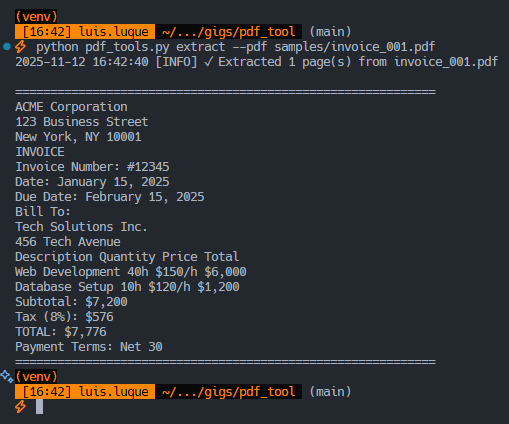
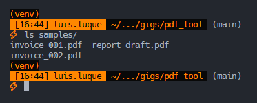
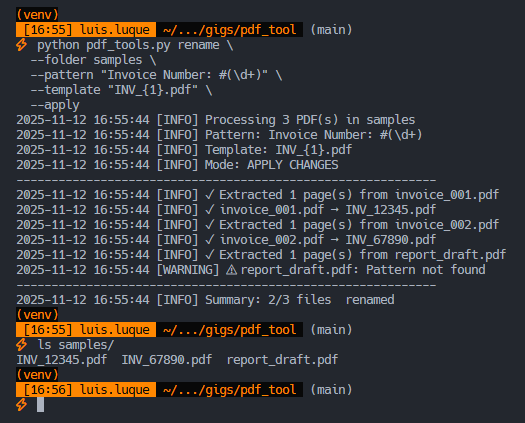

# PDF Batch Tools

[English (README.md)](README.md)

Extrae texto de PDFs y renombra archivos en batch usando patrones regex. Útil para organizar lotes de facturas, estandarizar archivos de documentos y extraer datos de documentos escaneados.

**Características principales:**

- Extracción de texto de páginas específicas
- Renombrado en batch basado en contenido del documento
- Matching de patrones regex con grupos de captura
- Modo dry-run para previsualizar cambios antes de aplicar
- Soporte para grupos regex posicionales y nombrados

## Instalación

```bash
python -m venv .venv && source .venv/bin/activate
# En Windows: .venv\Scripts\activate
pip install -r requirements.txt
```

## Demo rápida

### Extraer texto de PDF

```bash
python pdf_tools.py extract --pdf samples/invoice_001.pdf
```

**Resultado esperado:**

- Texto extraído impreso en consola con separadores
- Log mostrando cantidad de páginas procesadas

### Renombrado en batch (preview sin aplicar)

```bash
python pdf_tools.py rename \
  --folder samples \
  --pattern "Invoice Number: #(\d+)" \
  --template "INV_{1}.pdf"
```

**Resultado esperado:**

- Preview de todas las operaciones de renombrado
- Advertencia para archivos que no matchean el patrón
- Estadísticas resumen (ej: "2/3 archivos serían renombrados")
- Sin cambios reales en archivos (modo dry-run)

### Aplicar renombrado

```bash
python pdf_tools.py rename \
  --folder samples \
  --pattern "Invoice Number: #(\d+)" \
  --template "INV_{1}.pdf" \
  --apply
```

## Uso

```bash
python pdf_tools.py --help
```

### Subcomando extract

```bash
python pdf_tools.py extract --pdf ARCHIVO [--pages N]
```

**Parámetros:**

- `--pdf`: Ruta al archivo PDF (requerido)
- `--pages`: Cantidad de páginas a extraer (default: 1)

### Subcomando rename

```bash
python pdf_tools.py rename --folder DIR --pattern REGEX --template PLANTILLA [--pages N] [--apply]
```

**Parámetros:**

- `--folder`: Directorio con PDFs (requerido)
- `--pattern`: Patrón regex a buscar en el texto (requerido)
- `--template`: Plantilla de nuevo nombre (requerido)
- `--pages`: Páginas a escanear por PDF (default: 1)
- `--apply`: Ejecutar cambios (sin esta flag, corre en modo dry-run)

## Ejemplos comunes

### Extraer de múltiples páginas

```bash
python pdf_tools.py extract --pdf contrato.pdf --pages 3
```

### Renombrar facturas con fecha

```bash
# Patrón con múltiples grupos de captura
python pdf_tools.py rename \
  --folder ./facturas \
  --pattern "Factura: (\d+).*Fecha: (\d{4}-\d{2}-\d{2})" \
  --template "{2}_FAC_{1}.pdf" \
  --pages 2 \
  --apply
```

**Input:** `factura_vieja.pdf` con texto "Factura: 12345 ... Fecha: 2025-01-15"  
**Output:** `2025-01-15_FAC_12345.pdf`

### Grupos regex nombrados

```bash
python pdf_tools.py rename \
  --folder ./docs \
  --pattern "Orden ID: (?P<orden>\w+).*Cliente: (?P<cliente>\w+)" \
  --template "{cliente}_{orden}.pdf" \
  --apply
```

**Input:** `documento.pdf` con texto "Orden ID: A7B3 ... Cliente: ACME"  
**Output:** `ACME_A7B3.pdf`

### Extraer patrón de texto específico

```bash
# Encontrar todos los PDFs que contienen un patrón específico
python pdf_tools.py rename \
  --folder ./archivo \
  --pattern "URGENTE|PRIORIDAD" \
  --template "PRIORIDAD_{1}.pdf"
# Revisar salida dry-run para ver qué archivos matchearon
```

## Capturas de pantalla

### Salida de extracción de texto



### Antes del renombrado (nombres originales)



### Después del renombrado (nombres estandarizados)



## Cómo funciona

1. **Extracción de texto**: Usa `pdfplumber` para extraer texto de páginas especificadas
2. **Matching de patrones**: Aplica regex al texto extraído
3. **Grupos de captura**: Extrae valores usando sintaxis `()` o `(?P<nombre>)`
4. **Renderizado de plantilla**: Reemplaza `{1}`, `{2}` (posicional) o `{nombre}` (nombrado) con valores capturados
5. **Detección de colisiones**: Omite renombrado si el nombre de archivo objetivo ya existe
6. **Modo dry-run**: Comportamiento por defecto muestra preview sin modificar archivos

## Ejemplos de patrones regex

| Caso de uso | Patrón | Plantilla | Ejemplo |
| --- | --- | --- | --- |
| Número de factura | `Factura #(\d+)` | `FAC_{1}.pdf` | FAC_12345.pdf |
| Extracción de fecha | `Fecha: (\d{4}-\d{2}-\d{2})` | `{1}_doc.pdf` | 2025-01-15_doc.pdf |
| Orden + Cliente | `Orden: (?P<o>\w+).*Cliente: (?P<c>\w+)` | `{c}_{o}.pdf` | ACME_A7B3.pdf |
| Case insensitive | `contrato` (flag default) | `CONTRATO_{1}.pdf` | Matchea "Contrato" o "CONTRATO" |

**Flags regex aplicadas:** `re.IGNORECASE | re.MULTILINE`

## Stack tecnológico

- **Python 3.9+**
- **pdfplumber** - Extracción de texto PDF con preservación de layout
- **regex** - Matching de patrones con grupos de captura

## Resolución de problemas comunes

**Problema:** "No text extracted"  
**Solución:** El PDF puede ser imagen escaneada. Usar preprocesamiento OCR (pytesseract) o aumentar `--pages` si el texto está en páginas posteriores.

**Problema:** "Template error - Replacement index X out of range"  
**Solución:** La plantilla usa `{2}` pero el regex solo captura 1 grupo. Verificar regex en [regex101.com](https://regex101.com)

**Problema:** "Target filename already exists"  
**Solución:** Múltiples PDFs matchean al mismo nombre de salida. Refinar plantilla para incluir identificadores únicos (fechas, grupos adicionales).

## Próximos pasos

Después de organizar documentos:

- Construir base de datos searchable (SQLite con FTS)
- Extraer tablas usando `pdfplumber.extract_tables()`
- Agregar capa OCR para documentos escaneados
- Integrar con sistemas de gestión documental

## Licencia

MIT
